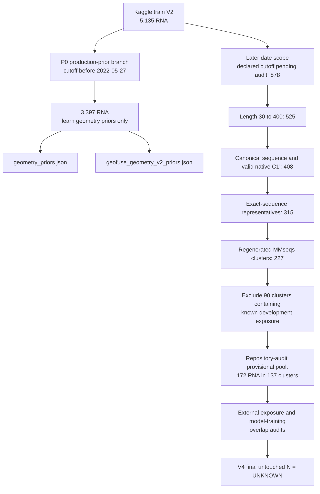
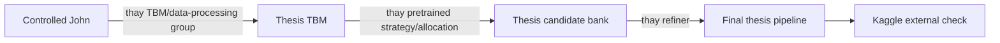

# V4 Preregistration: controlled rebuild from John to the thesis pipeline

Version: `FROZEN-1.0`, 2026-08-20

Status: **đã được review để freeze; tuyệt đối chưa mở final-test performance**

Repository state used for the first audit: `91b22391cdaa6ca968bb1480ced4b9734bd95d0e`

Freeze tag: `v4-preregistration-2026-08-20`

## 1. Mục đích của tài liệu

V4 dùng competition như một experimental setting có objective rõ ràng: một RNA
sequence được ánh xạ thành tối đa năm dự đoán cấu trúc 3D và được chấm bằng
TM-score. Scientific spine của nghiên cứu là:

> How do the major stages of an RNA 3D structure prediction pipeline contribute to the TM-score objective used in the Kaggle competition?

Ba research question phân rã pipeline theo thứ tự `retrieval/TBM -> candidate-source
allocation -> refinement -> final TM-score performance`:

- **RQ1 - Template-based modelling:** thay đổi nào của inherited TBM pipeline cải
  thiện best-of-five TM-score dưới một controlled protocol chung, và retrieval,
  ranking, reconstruction đóng góp thế nào?
- **RQ2 - Candidate-source diversification:** với budget năm prediction cố định,
  thay hai template candidates bằng candidates từ một independent pretrained
  predictor có cải thiện structural coverage và best-of-five TM-score không?
- **RQ3 - Geometric refinement:** geometric refinement có cải thiện local C1′
  structural accuracy vượt simple smoothing mà vẫn giữ global fold TM-score không?

Câu hỏi thực nghiệm trung tâm là:

> Khi public pipeline của John và pipeline thesis dùng cùng target, cùng template database, cùng luật chống leakage, cùng số candidate và cùng evaluator, thay đổi nào của thesis tạo ra improvement thật?

Tài liệu này khóa luật trước khi chạy final evaluation. Nó không phải Results chapter và không chứa kết luận rằng method nào tốt hơn.

Trong pha hiện tại được phép:

- đọc code, config và artifact đã tồn tại;
- kiểm kê target đã từng bị mở;
- tái dựng provenance của data;
- viết protocol, metrics, statistics và keep/drop gate;
- chạy các kiểm tra data-only không tính performance.

Trong pha hiện tại không được phép:

- generate hàng loạt DRfold2 hoặc Boltz cho final candidates;
- tính hoặc xem native performance của final untouched test;
- chọn target vì đã nhìn thấy target đó dễ hoặc khó;
- sửa method sau khi xem final-test result;
- dùng chênh lệch leaderboard Kaggle để gán contribution cho một component.

Sau khi tài liệu được commit và gắn freeze tag, mọi thay đổi phải được ghi vào mục
Amendment log. Reproduction và development experiments được phép bắt đầu, nhưng
final-test native performance vẫn khóa cho tới khi toàn bộ method và protocol được
freeze lần hai.

## 2. Tên gọi bắt buộc

V4 phân biệt ba loại số của John:

| Tên | Ý nghĩa | Được dùng để làm gì |
|---|---|---|
| `J-reported` | Điểm Kaggle hoặc điểm do John công bố | Bối cảnh bên ngoài, không dùng attribution |
| `J-original-local` | Code public của John chạy local với data rules gần notebook public nhất có thể | Kiểm tra mức reproduction |
| `J-controlled` | Thuật toán John chạy cùng target, template snapshot, temporal filter, self-exclusion, N và evaluator với thesis | Baseline chính cho claim thuật toán |

Tên mặc định trong luận văn là **reproduced publicly released John pipeline**. Chỉ được đổi thành “exact reproduction” nếu dataset, notebook version, dependencies, checkpoint, config, preprocessing và output đều có bằng chứng đủ mạnh.

Không được lấy `Thesis local - J-reported Kaggle` làm effect size. Comparator chính là paired difference `Thesis - J-controlled` trên cùng local target.

## 3. Những gì code audit đã xác minh

Các dòng dưới đây chỉ mô tả implementation, chưa mô tả performance.

| Nội dung | Trạng thái | Bằng chứng hiện có |
|---|---|---|
| Kaggle `train_sequences.v2.csv` có 5.135 target | VERIFIED | data-only audit từ file có SHA-256 trong snapshot |
| Production prior hiện ghi 3.397 target với cutoff `< 2022-05-27` | ARTIFACT VERIFIED | `geometry_priors.json` và `geofuse_geometry_v2_priors.json` |
| Public John TBM dùng exhaustive composite score và candidate clustering | VERIFIED FOR CAPTURED CODE | `utilities/top1_tbm.py`, port `src/rna3d/baselines/top1.py` |
| Public John hybrid chạy Boltz rồi đưa Boltz model 0 vào DRfold2 như AF3-style restraint cho một nhóm target | VERIFIED FOR CAPTURED CODE | `utilities/top1_4_4_hybrid_final_take.py` |
| Public John hybrid route target sang năm template hoặc năm DRfold2/Boltz outputs, thay vì trộn source trong cùng target | VERIFIED FOR CAPTURED CODE | cùng file trên |
| Thesis production hybrid thường dùng `3T + 2D`, thiếu D thì bù T | VERIFIED | `kaggle/hybrid_inference.py` |
| Thesis production Geometry mặc định 300 bước và `w_source=3.0` | VERIFIED | `GeometryV2Config` và production caller |
| Local 60/20/20 dùng prior/config khác production | VERIFIED HISTORICAL | prior provenance và frozen config cũ |
| Public notebook giống exact final winning submission | UNKNOWN | chưa có full final submission provenance |
| DRfold2 structural cutoff và RCLM language-model pretraining đều an toàn với final targets | UNKNOWN | phải audit riêng hai nguồn training |

Ma trận đầy đủ nằm tại [JOHN_VS_THESIS_COMPONENT_MATRIX.md](reports/thesis_v4/preregistration/JOHN_VS_THESIS_COMPONENT_MATRIX.md) và bản CSV cùng thư mục.

## 4. Provenance của 5.135 RNA

### 4.1 Hai nhánh có vai trò khác nhau

Điểm quan trọng:

- 3.397 RNA là **data học production geometry prior**, không phải final test.
- 60/20/20 là historical/exploratory cohort, không còn là backbone của V4.
- 172 là kết quả data-only của luật V4 hiện tại, không phải final N. Các bước tạo
  con số này là auditable trong master ledger: 408 technical-valid RNA, 315 exact
  sequence representatives, 227 regenerated MMseqs clusters, rồi loại 90 clusters
  có development exposure đã biết.
- Các số 419, 354, 239 và old 60/20/20 chỉ mô tả historical/exploratory split. Chúng
  không còn là backbone hoặc candidate universe của V4.
- Nhánh later hiện dựa trên declared structural cutoff `2023-12-31`. Cutoff này phải được audit lại trước khi trở thành luật V4 chính thức.

Master ledger đúng đủ 5.135 dòng nằm tại
[v4_master_rna_ledger.csv](reports/thesis_v4/preregistration/v4_master_rna_ledger.csv).
CASP15 được quản lý riêng tại
[casp15_development_ledger.csv](reports/thesis_v4/preregistration/casp15_development_ledger.csv).
Regenerated cluster assignments, FASTA input, exact command, binary version và hash
nằm cùng thư mục preregistration. Historical data-flow table được giữ để giải thích
vì sao các cohort cũ không được dùng làm confirmatory set.

### 4.2 P0-production và P1-robust

`P0-production` phải tái lập đúng method đã deploy, gồm:

- exact 3.397 target IDs;
- `geometry_priors.json`;
- `geofuse_geometry_v2_priors.json`;
- Geometry config production, gồm `steps=300` và `w_source=3.0`;
- code, environment và input hashes.

P0 được coi là reproduced khi:

1. manifest ID và thứ tự canonical hóa khớp;
2. số chain là 3.397;
3. schema và mọi trường prior khớp;
4. sai số tuyệt đối lớn nhất của giá trị số không quá `1e-10`;
5. nếu byte hash khác do serialization nhưng numeric values khớp, cả hai hash và lý do được lưu.

Không được thay mean, std, Rg fit, source weight hoặc context prior rồi vẫn gọi P0.

Nếu audit development cho thấy cần robust prior mới, nó được đặt tên `P1-robust`. P1 phải có manifest, config và hash riêng. P1 chỉ thay P0 trong final method nếu được chọn hoàn toàn trên development data trước khi mở final test.

## 5. Development exposure ledger

Exposure ledger chi tiết có 3.516 target:

- 3.397 RNA cũ đã dùng native C1′ để học P0 production priors;
- 118 target khác đã từng native-scored hoặc dùng native supervision;
- 1 target `8YUR_X` không được native-scoring nhưng predictor/Arena failure đã được inspect và dẫn tới technical replacement;
- 107 target thuộc Kaggle train V2 ngoài P0 đã được xác nhận development-exposed;
- 12 CASP15 targets được quản lý riêng và luôn là development-only;
- regenerated V4 clustering đặt các eligible development targets vào 90
  MMseqs sequence-similarity clusters;
- loại các cluster đó khỏi 315 exact-sequence representatives để lại 172 RNA trong
  137 clusters đang chờ pretrained/external exposure audit.

File per-target là [development_exposure_ledger.csv](reports/thesis_v4/preregistration/development_exposure_ledger.csv). Ledger dùng rule bảo thủ: nếu target từng ảnh hưởng lựa chọn method thì target đó không còn untouched.

Ledger hiện mới audit repository artifacts. Các mục sau vẫn `UNKNOWN`:

- target đã xem thủ công ở notebook hoặc máy khác nhưng không commit;
- bảng, ảnh hoặc spreadsheet nằm ngoài repository;
- target đã gửi qua một external service;
- failure case được nhớ và dùng để sửa code nhưng không có artifact;
- pretrained training overlap chưa được kiểm.

Trước khi tạo final manifest, researcher phải xác nhận hoặc bổ sung exposure ngoài repository. Nếu không xác minh được một target, target hoặc cả MMseqs cluster của nó bị loại khỏi final.

Toàn bộ 3.397 P0 prior-training RNAs, CASP15 12 targets và old 60/20/20 không đủ điều kiện làm final untouched. Chúng vẫn dùng được đúng vai trò đã khai báo: P0 data chỉ học prior; CASP và cohort cũ dùng cho development, debugging và historical reconstruction.

## 6. Cách xây development và final untouched test

### 6.1 Scope và filter được khóa trước performance

Candidate universe bắt đầu từ toàn bộ later eligible RNA trong Kaggle train V2. Rule theo đúng thứ tự:

1. Target date phải muộn hơn structural-training cutoff đã audit của pretrained model được dùng.
2. Target date không muộn hơn ngày cuối của Kaggle train V2 snapshot đã hash.
3. Sau khi chuẩn hóa `T -> U`, sequence chỉ chứa `A, U, G, C`.
4. Length trong scope C1′ thesis: 30 đến 400 nucleotide.
5. Có ít nhất một native reference với ít nhất 3 C1′ hữu hạn và ít nhất 80% residue resolved.
6. Exact duplicate được định nghĩa bằng SHA-256 của normalized sequence. Chỉ giữ một representative: target có ngày mới nhất, nếu hòa chọn `target_id` nhỏ nhất theo thứ tự từ điển.
7. Chạy MMseqs `easy-cluster` với `--min-seq-id 0.8 -c 0.8 --cov-mode 0`, dùng binary/version đã khóa. Gọi output là **MMseqs sequence-similarity cluster**, không gọi biological family.
8. Loại target và toàn bộ cluster nếu có bất kỳ member nào trong exposure ledger.
9. Loại exact hoặc homolog overlap với structural training set của DRfold2/Boltz theo audit đã định.
10. Language-model pretraining overlap được report riêng. Nếu training corpus không thể audit, không claim pretrained branch là time-safe.
11. Loại technical-invalid target bằng rule native-blind đã khóa, ví dụ sequence không hợp lệ, predictor không thể parse input, hoặc native reference không đạt rule ở bước 5. Không được loại vì score thấp.

### 6.2 Development set

Development ưu tiên tái sử dụng target đã exposed thay vì hy sinh target untouched mới:

- 107 later targets trong ledger cho calibration, mechanism analysis và runtime profiling;
- CASP15 cho historical reconstruction, leakage diagnostic và reproduction debug;
- không dùng CASP15 làm primary final evidence;
- mọi tuning của P1, source allocation, confidence, pair-like, Rg và refiner config phải kết thúc ở development.

Nếu một mechanism không thể tune từ development hiện có, phải viết preregistration amendment trước khi lấy thêm development target.

### 6.3 Final untouched test

Mặc định dùng **toàn bộ eligible untouched targets** sau mười filter. `N` hiện là
`UNKNOWN`; không mặc định 46, 100, 172, 195 hay 239.

172 là provisional count sau repository audit và regenerated V4 clustering. Không
RNA nào trong số đó được gắn nhãn untouched: model-training overlap và exposure ngoài
repository vẫn là `AUDIT_PENDING`. Audit tiếp theo có thể loại target hoặc toàn bộ
cluster, nhưng không được thêm target bằng cách nới filter sau khi nhìn performance.

Nếu compute không đủ:

1. benchmark runtime chỉ trên development;
2. khóa GPU-hour budget và suy ra `N` trước final candidate generation;
3. chia length bin cố định: 30-79, 80-149, 150-249, 250-400;
4. phân bổ N theo tỷ lệ target trong từng bin, dùng largest-remainder rounding;
5. trong mỗi bin sort theo SHA-256 của `V4_FINAL_SEED_2026|target_id|normalized_sequence` và lấy từ đầu;
6. lưu cả eligible manifest và sampled manifest cùng hash;
7. không đọc native performance trong quá trình sampling.

Target manifest final được mã hóa vai trò và lưu tách khỏi score output. Người chạy prediction chỉ cần sequence và metadata cần thiết, không cần native coordinates.

## 7. Audit pretrained model trước evidence

### 7.1 DRfold2

Phải đóng đủ các mục:

- source repository URL, commit và diff với checkout local;
- exact driver, `cfg_97`, Selection, Optimization và Arena versions;
- SHA-256 của cả 20 cfg_97 checkpoints;
- SHA-256 của RCLM checkpoint;
- structural training FASTA hoặc manifest, release cutoff và preprocessing;
- exact-sequence overlap với every development/final candidate target;
- homolog overlap bằng cùng MMseqs identity/coverage rule;
- provenance của RCLM sequence-language-model pretraining, tách khỏi structural training;
- seed, model count, clustering mode, timeout, max length và candidate selection rule.

Checkout local hiện dirty. Vì vậy chưa được dùng nó như frozen evidence. Phải tạo clean immutable copy và lưu diff trước reproduction.

### 7.2 Boltz

Nếu Boltz được dùng để reproduce John hoặc so candidate diversity, cần tương tự:

- source commit;
- `boltz1_conf.ckpt` hash;
- dependency/Kaggle dataset version;
- MSA/template settings;
- structural training cutoff;
- language-model or sequence-data provenance;
- exact/homolog overlap;
- seeds và diffusion/sample count.

Nếu không lấy được những artifact này, Boltz experiment được ghi `NOT REPRODUCIBLE WITH AVAILABLE ARTIFACTS` và không dùng làm primary evidence. Khi đó public John hybrid reproduction phải được gọi partial.

## 8. Reproduce John

### 8.0 Common controlled protocol

`J-controlled` và thesis cùng dùng một `DB-controlled` được dựng từ toàn bộ valid parsed RNA chains của một PDB_RNA snapshot đã hash. Current artifact có 23.869 chains từ 8.613 PDB entries, nhưng con số và coordinate-store hash phải được freeze lại trước experiment. Không bên nào được dùng thêm một private subset.

Trên mỗi target, cả hai cùng áp dụng:

- template release date strictly earlier than target cutoff;
- direct target-PDB exclusion;
- cùng sequence normalization;
- cùng maximum candidate count;
- cùng evaluator;
- cùng raw-candidate boundary trước refiner.

`J-original-local` vẫn giữ data rules public để kiểm tra reproduction. `J-controlled - J-original-local` chỉ mô tả ảnh hưởng của data/protocol normalization, không phải thesis algorithmic gain.

### 8.1 John TBM-only

Audit và đóng băng:

- input table và coordinate extraction;
- multi-tier length filter;
- global/local alignment parameters;
- handcrafted sequence features;
- 3-mer Jaccard;
- composite weights `0.4/0.3/0.2/0.1`;
- top-pool rule, KMeans/farthest selection và seed 42;
- coordinate transfer;
- gap completion;
- `adaptive_rna_constraints`;
- de novo fallback và randomness.

Local port 7.155 unique sequences không đủ để xác nhận exact public input vì notebook public báo 18.815 coordinate groups. Reproduction report phải định lượng mismatch này.

Public TBM thêm Gaussian jitter sau John rule-refiner. Vì H1 cần so candidate generation trước refinement, `J-controlled-TBM-raw` được lấy sau coordinate transfer/gap completion nhưng trước rule-refiner và jitter. `J-original-local` vẫn giữ rule-refiner và jitter như captured notebook. Hai boundary này không được trộn trong cùng bảng.

### 8.2 John public hybrid

Code capture hiện cho thấy:

1. chạy Boltz-1 model 0;
2. convert CIF sang PDB;
3. chạy DRfold2 `cfg_97`;
4. dùng Boltz structure như AF3-style restraint, weight 2.0 ở selection và 2.5 ở folding trong captured config;
5. chạy DRfold2 optimization và Arena;
6. lấy tối đa năm PDB, thiếu thì duplicate output cuối;
7. route các target khác về public template pipeline khi ngoài index/time range hoặc khi DRfold lỗi.

Phải giữ đúng behavior public, kể cả behavior dựa trên retained DataFrame index, trong `J-original-local`. Nếu cần sửa một implementation bug để làm comparator khoa học hơn, bản sửa phải là baseline mới có tên riêng, ví dụ `J-controlled-fixed-index`, và cả hai được report.

### 8.3 Reproduction acceptance

Reproduction được coi đủ để tiếp tục nếu:

- code path thực sự chạy end to end trên development smoke targets;
- candidate count, source route và fallback khớp captured notebook;
- intermediate file shapes và target ordering khớp;
- mọi deviation có bảng riêng;
- score trên benchmark có reported comparable result được report, nhưng không đặt tolerance tùy ý sau khi nhìn score.

Hiện chưa có một benchmark có cùng hidden labels để đòi score bằng John Kaggle. Vì vậy acceptance chủ yếu là behavioral and artifact reproduction, không phải ép local score bằng leaderboard.

## 9. Incremental ladder chính

Mỗi mũi tên chỉ thay một nhóm conceptually coherent. Mọi cell phải dùng cùng target manifest và evaluator. Không ép các bước phải tăng score.

Ngoài ba primary hypotheses, V4 giữ một descriptive end-to-end table gồm public
John TBM, J-controlled TBM, public John hybrid, J-controlled full pipeline và final
thesis pipeline. Bảng này cho biết normalization và complete-system behavior, nhưng
không dùng để gán một delta cho retrieval, pretrained source hoặc refinement vì
nhiều component thay đổi đồng thời.

## 10. Ba primary hypotheses

### H1. Thesis TBM so với controlled John TBM

- Comparator: `Thesis TBM - J-controlled TBM`.
- Cùng target, template database, temporal gate, self-exclusion, evaluator và `N=5` raw candidates.
- Primary unit: RNA target.
- Primary metric: best-of-5 TM-score.
- Directional effect: `TM_ThesisTBM - TM_J-controlledTBM > 0`.
- Success: cluster-aware one-sided permutation p-value pass Holm step-down ở
  family-wise alpha 0.05 và cluster-bootstrap 95% CI có lower bound lớn hơn 0.
- Nếu point estimate dương nhưng test hoặc CI không pass: report inconclusive,
  không claim demonstrated improvement.

### H2. Candidate-source diversification: `3T+2D` so với `5T`

- Cùng Thesis TBM, cùng target, cùng candidate budget `N=5`, Raw và không refinement.
- Comparator: `3T+2D - 5T`; chỉ thay allocation của hai candidate slots.
- Primary metric: best-of-5 TM-score.
- Directional effect: `TM_3T+2D - TM_5T > 0`.
- Success: cluster-aware one-sided permutation p-value pass Holm step-down và
  cluster-bootstrap 95% CI có lower bound lớn hơn 0.
- `2T`, `1T+1D`, `2D`, Boltz và self-TM là mechanism analyses. Controlled John
  candidate bank so với Thesis bank là secondary end-to-end comparison, không dùng
  để attribution pretrained contribution.

### H3. Full Geometry tốt hơn Simple trên cùng raw candidates

- Primary bank: frozen Thesis candidate bank.
- Mỗi raw candidate được đưa qua cả Simple và Geometry.
- Primary local metric: candidate-level SW-RMSD9, lower is better.
- Với mỗi target, lấy mean SW-RMSD9 qua năm paired candidates; sau đó inference theo
  regenerated MMseqs sequence-similarity clusters.
- Directional superiority effect được định nghĩa `SW-RMSD9_Simple - SW-RMSD9_Geometry > 0`.
- Superiority success: cluster-aware one-sided permutation p-value pass Holm
  step-down và cluster-bootstrap 95% CI của effect có lower bound lớn hơn 0.
- Global safeguard: lower bound của cluster-bootstrap 95% CI cho paired bank-level
  `TM_Geometry - TM_Simple` phải lớn hơn `-0.005`.
- H3 chỉ pass khi cả local superiority và global noninferiority pass.
- Nếu H3 fail, Simple trở thành final refiner. Full Geometry xuống appendix, không được cứu bằng metric nằm trong objective.

## 11. Exact experiment table

Registry đầy đủ ở [experiment_registry.csv](reports/thesis_v4/preregistration/experiment_registry.csv). Headline factorial là:

| Candidate bank | Raw | John refiner | Simple | Geometry |
|---|---:|---:|---:|---:|
| J-controlled candidates | ✓ | ✓ | ✓ | ✓ |
| Thesis candidates | ✓ | ✓ | ✓ | ✓ |

Các cell dùng đúng cùng raw coordinates. Không regenerate raw candidates cho từng refiner.

Để bảng này không dùng tên mơ hồ, bốn refiner cells được định nghĩa như sau:

- `Raw`: giữ nguyên raw C1′ coordinates, không optimization.
- `John refiner`: đúng ba rule đã port từ `adaptive_rna_constraints`: sửa adjacent distance ngoài 5.5-6.5 Å, đẩy non-neighbor clash dưới 3.8 Å, và kéo complementary-base proxy về 10.5 Å khi rule confidence cho phép. Trong end-to-end J-controlled dùng confidence contract gốc. Trong same-candidate factorial, main `John refiner` cell khóa fixed `confidence=0.5` để kết quả không phụ thuộc calibration khác nhau giữa T, D và B. Original-confidence factorial được report riêng như sensitivity analysis.
- `Simple`: Adam 300 bước, learning rate 0.04, source Huber weight 3.0, adjacent-backbone Huber weight 1.0, fixed geometry strength 1.0; tắt clash, Rg, angle, torsion, kink và pair-like context. Huber delta giữ giống Geometry implementation. Đây là source anchoring + backbone smoothing baseline.
- `Geometry`: frozen full configuration được chọn trên development theo keep/drop gates. Nó không được thay sau final opening.

Primary H3 luôn là `Geometry - Simple`. John original-confidence sensitivity là supporting evidence, không thay comparator chính.

### 11.1 TBM secondary ablations

- MMseqs-only;
- composite-only;
- MMseqs + composite;
- global-only `G` so với full `0.4G + 0.3L + 0.2F + 0.1K3`;
- `identity`;
- `identity × query coverage`;
- `identity × query coverage × template completeness`;
- thêm distinct-PDB selection;
- John gap, linear gap và curved gap trên cùng correspondence;
- time-safe so với intentionally unsafe trên development only.

Gap analysis dùng các bin khóa trước: 1-2, 3-5, 6-8, 9-20 và trên 20 nucleotide. Primary gap diagnostic là SW-RMSD9 trên residue thuộc gap và cửa sổ có chứa gap. Whole-target TM là supporting metric.

### 11.2 Candidate-source allocation và fixed-N analyses

Nguồn ký hiệu:

- `T`: raw template candidate;
- `D`: direct DRfold2 candidate của thesis;
- `B`: Boltz candidate hoặc Boltz-constrained branch, chỉ khi reproduction đủ artifact.

Primary H2 comparison là `5T` so với `3T+2D`. Cùng Thesis TBM tạo T, cùng target,
cùng `N=5`, cùng frozen generation budget và Raw candidates. Nếu D không available,
frozen TBM fallback ở Section 14 được tính trong all-target primary analysis.

Mechanism comparisons là `2T`, `1T+1D`, `2D`. Nếu Boltz available: thêm `1T+1B`,
`1D+1B` và matched-N cần thiết. Một failed `2D` run vẫn là source failure; không
được thay T rồi đặt tên output là `2D`.

Với mỗi bank đo:

- best-of-N TM;
- top-1 TM theo frozen native-blind ranker;
- pairwise self-TM giữa candidates;
- source availability;
- duplicate/near-duplicate candidate rate.

Nếu các independent sources tạo gain tương tự và gain đi cùng lower self-TM, claim là **independent-source diversity**, không claim DRfold2 specifically superior.

### 11.3 Mechanism analyses

Confidence:

- shared raw confidence;
- fixed refinement strength;
- source-specific calibration nếu development đủ data.

Pair-like:

- candidate-derived pair-like;
- unconditional prior;
- sequence-only context nếu feasible.

Rg:

- Rg on/off trong length bins 30-79, 80-149, 150-249, 250-400;
- report support của P0 training distribution trong từng bin.

Các analyses này là secondary. Không được đổi primary hypotheses sau khi xem kết quả.

## 12. Evaluation ở hai cấp

### 12.1 Candidate-level

Mục tiêu là đo refinement effect sạch.

Với mỗi raw candidate:

1. tính TM của raw candidate với mọi native conformation;
2. khóa native reference có raw TM cao nhất, hòa thì lấy reference index nhỏ nhất;
3. dùng đúng reference đó cho Raw, John, Simple và Geometry;
4. tính SW-RMSD9, SW-RMSD15, C1′-lDDT adaptation, C1′ RMSD và candidate TM;
5. aggregate candidates trong target trước khi aggregate targets.

Reference selection chỉ dựa vào Raw nên refiner không được chọn native có lợi riêng.

### 12.2 Bank-level

Mục tiêu là đo full pipeline theo competition logic:

- năm predictions mỗi target;
- TM là max qua `5 predictions × all native conformations`;
- target score được average qua targets;
- mọi bank phải có đúng N đã định.

Không trộn candidate-level row thành sample độc lập. Statistical unit luôn là RNA target.

## 13. Metrics

### Primary

- H1, H2: C1′ best-of-5 TM-score chuẩn hóa theo reference bằng US-align.
- H3: SW-RMSD9 candidate-level, lower is better.
- H3 safeguard: bank-level TM delta không tệ quá `-0.005`.

### Supporting independent metrics

- C1′-lDDT adaptation với inclusion radius 15 Å và thresholds 0.5, 1, 2, 4 Å;
- SW-RMSD15;
- global C1′ RMSD;
- best-of-five TM cho factorial bank;
- pairwise self-TM cho candidate diversity.

### Diagnostics, không phải independent proof

- adjacent-backbone deviation;
- clash proxy;
- sharp-kink count;
- angle NLL;
- torsion NLL;
- pair-like fraction;
- radius-of-gyration deviation.

Lý do: Geometry trực tiếp optimize nhiều diagnostic ở nhóm cuối. Việc chúng tốt hơn chỉ chứng minh optimizer làm giảm objective của chính nó, không tự chứng minh prediction gần native hơn.

## 14. Statistical plan

- Statistical unit: RNA target. Regenerated MMseqs sequence-similarity cluster là
  dependence/block unit; candidate hoặc native conformation không phải replicate.
- Với mỗi hypothesis, trước hết tính đúng một paired delta cho mỗi target. H1 và H2
  dùng TM difference theo hướng positive. H3 dùng
  `SW-RMSD9_Simple - SW-RMSD9_Geometry`, cũng theo hướng positive.
- Primary point estimate là target-weighted arithmetic mean của paired target deltas.
- Cluster-bootstrap CI: `10.000` replicates, NumPy `PCG64` seed `20260819`.
  Trong mỗi replicate, lấy mẫu có hoàn lại đúng `K` cluster IDs từ `K` regenerated
  clusters; mỗi lần một cluster được lấy, mang theo toàn bộ target deltas của cluster
  đó; tính target-weighted mean trên multiset thu được. CI là percentile 2.5% và
  97.5%. Luôn gọi đây là **cluster-bootstrap CI**, không gọi Holm-adjusted CI.
- Raw superiority p-value: `100.000` cluster sign-flip permutations, NumPy `PCG64`
  seed `20260819`. Trong mỗi permutation, mọi target delta trong cùng một cluster
  nhận cùng dấu `+1` hoặc `-1`. Statistic là target-weighted mean. One-sided raw
  p-value là `(1 + count(permuted_stat >= observed_stat)) / 100001`.
- Multiple primary tests: sort ba raw p-values của H1, H2 và H3 tăng dần. Holm
  step-down so sánh lần lượt với `0.05/3`, `0.05/2`, `0.05/1`; dừng và reject không
  thêm hypothesis nào sau lần fail đầu. Holm-adjusted p-value được tính bằng running
  maximum của `(3-i+1) * p_(i)`, cap tại 1, rồi trả về thứ tự hypothesis gốc.
- H3 TM safeguard không nằm trong Holm family. Nó pass riêng khi lower bound của
  cluster-bootstrap 95% CI cho `TM_Geometry - TM_Simple` lớn hơn `-0.005`.
- Report: target N, cluster K, target-weighted mean, median, cluster-bootstrap CI,
  raw p, Holm-adjusted p, improved/tied/regressed counts và raw per-target appendix.
- Tie threshold: absolute delta nhỏ hơn `1e-6`.
- Scores/errors chính hiển thị 3 chữ số thập phân. Delta và CI gần 0 hiển thị 4 chữ số. Tất cả phép tính dùng unrounded values.
- Missing output không được silently drop. Primary evaluation luôn giữ toàn bộ
  frozen target manifest theo fallback/failure contract dưới đây. Complete-case chỉ
  là sensitivity analysis và phải report failure counts.
- Length-bin, source-available, complete-case và overlap-status analyses là
  sensitivity/mechanism results; chúng không thay all-target primary inference.

### 14.1 Primary fallback và failure contract

- Nếu TBM không đủ template candidates, điền các slot thiếu bằng frozen de novo
  fallback của method tương ứng. Output fallback được chấm như prediction bình thường.
- Trong H2 `3T+2D`, nếu D không available hoặc failed, mỗi D slot được thay bằng
  frozen Thesis TBM fallback. All-target primary giữ target này. Một source-available
  subset được report riêng và không thay primary population.
- Nếu Simple hoặc Geometry numerical optimization failed trên một raw candidate,
  output của cell đó là chính Raw candidate và failure flag được lưu.
- Nếu cả bank vẫn failed sau mọi frozen fallback, bank-level target TM được gán `0`
  trong primary analysis. Không target nào bị silently dropped.
- Trong mechanism bank `2D`, D failure được ghi là D source failure. Output thay thế,
  nếu có để kiểm tra execution, không được đổi nhãn thành `2D`.
- Fallback rate, total-bank failure rate và nguyên nhân được report cho từng method.
  Fallback chỉ được gọi demonstrated robustness nếu experiment tương ứng support;
  nếu không, nó là execution safety path.

Nếu final N sau audit quá nhỏ để CI có ý nghĩa, V4 report uncertainty thay vì đổi alpha, đổi metric hoặc gộp candidate thành pseudo-replicates.

## 15. Keep/drop rules

| Component | Giữ như demonstrated contribution khi | Nếu không đạt |
|---|---|---|
| Thesis TBM group | H1 pass | Không claim improvement; dùng simpler/better development method và gọi safeguards đúng vai |
| MMseqs branch | Tăng whole-cohort quality hoặc availability mà không làm quality giảm theo gate development | Nếu chỉ tăng availability, gọi retrieval safeguard; nếu không giúp thì bỏ |
| Full composite | Tốt hơn G-only theo development gate đã khóa | Dùng G-only hoặc gọi full composite inherited recall heuristic |
| Coverage reranking | Paired development gain có hướng ổn định và được xác nhận trong H1 group | Bỏ khỏi contribution claim |
| Completeness | Tạo gain đo được beyond coverage | Nếu không, chỉ gọi robustness tie-break hoặc bỏ |
| Distinct PDB | Tăng best-of-N hoặc giảm redundancy mà không giảm TM vượt 0.005 | Gọi diversity safeguard hoặc bỏ |
| Curved gap | Tốt hơn linear/John trong preregistered gap bins | Dùng method đơn giản nhất không kém |
| Direct DRfold2 source | Fixed-N TM tốt hơn alternatives sau overlap audit | Nếu Boltz cho gain tương tự, claim source diversity; nếu không giúp thì bỏ D |
| Confidence modulation | Tốt hơn fixed strength trên development independent metrics và giữ TM | Dùng fixed strength |
| Candidate-derived pair-like | Tốt hơn unconditional prior | Dùng unconditional hoặc bỏ term |
| Rg | Không gây harm trong supported length bins; benefit development rõ | Clip/tắt ngoài supported range hoặc bỏ |
| Full Geometry | H3 pass cả SW-RMSD9 và TM safeguard | Simple là final refiner; Geometry appendix |
| Fallback | Có sample đủ và quality được đo | Chỉ gọi execution safety path |
| P1-robust | Chọn trên development và sau freeze vượt P0 trên final | P0 giữ vai trò production prior; P1 không deploy |

Không có keep/drop rule nào được thay sau final opening.

## 16. Historical inconsistency audit

Trước final experiment phải reconstruct từ artifact, không sửa bằng suy đoán:

- CASP15 John TBM;
- thesis TBM;
- hybrid raw;
- hybrid refined;
- nguồn của 0.465 và 0.307;
- R1128 exact overlap sensitivity;
- R1138 source-aware overlap/fallback sensitivity;
- từng target dùng bao nhiêu T, D hoặc B;
- provenance của `source_weight=1.5` và `source_weight=3.0`;
- config và candidate-cache hash tạo từng bảng.

Output của audit này là một ledger riêng. Nếu số cũ không truy được source artifact, nó được đánh `UNVERIFIED` và không xuất hiện trong main Results.

## 17. Freeze checklist trước final opening

Phải freeze và hash:

- target eligibility manifest và final sampled manifest nếu có;
- exposure ledger đã researcher xác nhận;
- exact-sequence groups và MMseqs cluster output;
- common template database metadata, coordinates và release snapshot;
- P0 hoặc P1 prior và config;
- J-original-local và J-controlled code/config;
- DRfold2/Boltz source, checkpoints và provenance;
- raw candidate generation rules, seeds, timeout và fallback;
- candidate caches;
- Raw, John, Simple và Geometry configs;
- evaluator binaries và metric code;
- native-reference locking code;
- bootstrap seed, multiplicity correction và keep/drop gates;
- environment lock;
- git commit.

Checklist chi tiết: [artifact_hash_checklist.csv](reports/thesis_v4/preregistration/artifact_hash_checklist.csv).

Final opening phải tạo một receipt gồm timestamp, operator, commit, target-manifest hash và config hashes. Technical rerun chỉ được phép khi có implementation/evaluation bug được mô tả. Rerun không được đổi scientific method.

## 18. Kaggle chỉ là external check

Sau local final test và method freeze, full deployed pipeline mới được submit lên Kaggle.

Kaggle được dùng cho câu:

> Full frozen pipeline đạt performance này trên hidden competition targets.

Do aggregate leaderboard scores của các pipeline trước đã được nhìn trong quá trình
development, Kaggle không được gọi là một prospective untouched test mới. Nó là
external hidden benchmark của complete deployed system: target-level labels vẫn ẩn,
nhưng aggregate feedback đã từng được exposed.

Kaggle không được dùng cho các câu:

- DRfold2 đóng góp bao nhiêu;
- Geometry đóng góp bao nhiêu;
- reranking đóng góp bao nhiêu;
- thesis component nào hơn John component nào.

Các claim component phải đến từ paired controlled local experiments.

## 19. UNKNOWN phải audit trước khi chạy lớn

### John

1. Exact Kaggle notebook ID/version của TBM-only capture.
2. Exact Kaggle notebook ID/version của hybrid capture.
3. Dataset versions và hashes của `rna-cif-to-csv`, `rna-all-data`, DRfold2 và Boltz inputs.
4. Public hybrid có hoàn toàn giống final winning submission hay không.
5. Dependency lock, CUDA image và random seeds đầy đủ.
6. Template database release dates và liệu public hidden run có self/temporal exclusion ngoài code capture hay không.

### DRfold2

7. Clean source commit tương ứng checkpoint.
8. Hash của cả 20 cfg_97 model files.
9. Structural training manifest và exact cutoff.
10. Ý nghĩa và tính đầy đủ của local `data/train.fasta`.
11. RCLM sequence-pretraining corpus, date range và overlap.
12. MMseqs exact/homolog overlap với proposed final universe.

### Boltz

13. Source commit và `boltz1_conf.ckpt` hash.
14. Training-data provenance và overlap.
15. Exact MSA/template settings, seed và sample count của John notebook.

### Thesis artifacts

16. Exact 3.397-target P0 manifest chưa được lưu thành standalone hashed file.
17. Hash của production template coordinate store và common controlled snapshot.
18. External/manual exposure ngoài repository.
19. Exact source artifacts cho historical 0.465/0.307 and R1128/R1138 tables.
20. Final eligible N sau full audits.
21. Có đủ compute dùng toàn bộ final eligible targets hay phải deterministic sample.

Không được tự điền các mục này bằng trí nhớ. Mỗi mục phải chuyển thành `VERIFIED`, `UNAVAILABLE` hoặc `NOT APPLICABLE`, kèm evidence.

## 20. Thứ tự thực hiện sau preregistration freeze

1. Freeze master ledger 5.135 RNA và CASP15 development ledger riêng.
2. Commit/tag preregistration.
3. Audit và tái lập `P0-production`.
4. Làm sạch, hash và reproduce public John TBM-only.
5. Làm sạch, hash và reproduce public John hybrid ở mức artifact cho phép.
6. Tạo common controlled template database và `J-controlled`.
7. Hoàn thành DRfold2/Boltz provenance và overlap audits.
8. Chạy development ladder và secondary ablations.
9. Áp dụng keep/drop gates, chọn P0/P1 và Simple/Geometry trên development.
10. Freeze method, manifest, environment, code và statistics.
11. Generate final candidates native-blind.
12. Mở final labels một lần, chạy H1-H3 và factorial đã khóa.
13. Không retune. Chỉ rerun documented technical bug.
14. Submit full frozen pipeline lên Kaggle như external deployment check.
15. Cập nhật thesis V4 sau mỗi evidence gate, không kéo claim V3 vào nếu chưa reproduce.

## 21. Review gates

GO review ngày 2026-08-20 đã xác nhận:

- [x] tên baseline và component matrix đúng;
- [x] exposure ledger trong repository đã được dựng; external/manual exposure giữ `AUDIT_PENDING`;
- [x] P0/P1 distinction đúng;
- [x] final target construction rule được chấp nhận;
- [x] three hypotheses và metrics đúng câu hỏi thesis;
- [x] H2 `5T vs 3T+2D`, fixed-N mechanisms và 2x4 factorial đúng;
- [x] TM noninferiority margin `-0.005` được chấp nhận;
- [x] exact cluster-aware Holm/permutation/bootstrap plan được chấp nhận;
- [x] primary fallback/failure contract được chấp nhận;
- [x] keep/drop rules và UNKNOWN list được chấp nhận;
- [x] preregistration được commit và nhận freeze tag được ghi ở đầu tài liệu.

## 22. Amendment log

| Ngày | Thay đổi | Lý do | Có xem final performance trước thay đổi không? | Commit |
|---|---|---|---|---|
| 2026-08-19 | Tạo draft đầu tiên từ code/artifact audit | Bắt đầu V4 rebuild | Không | pre-freeze working tree |
| 2026-08-20 | Khóa H2 `5T vs 3T+2D`, master ledger 5.135 RNA, cluster-aware inference, all-target failure contract và secondary John-to-thesis table | GO review cuối trước Phase 1 | Không | freeze tag `v4-preregistration-2026-08-20` |

Mọi amendment sau khi freeze phải được thêm vào đây trước khi chạy phần bị ảnh hưởng.
