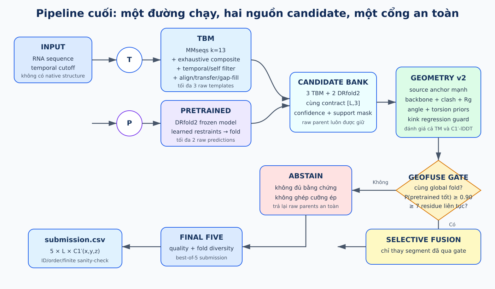
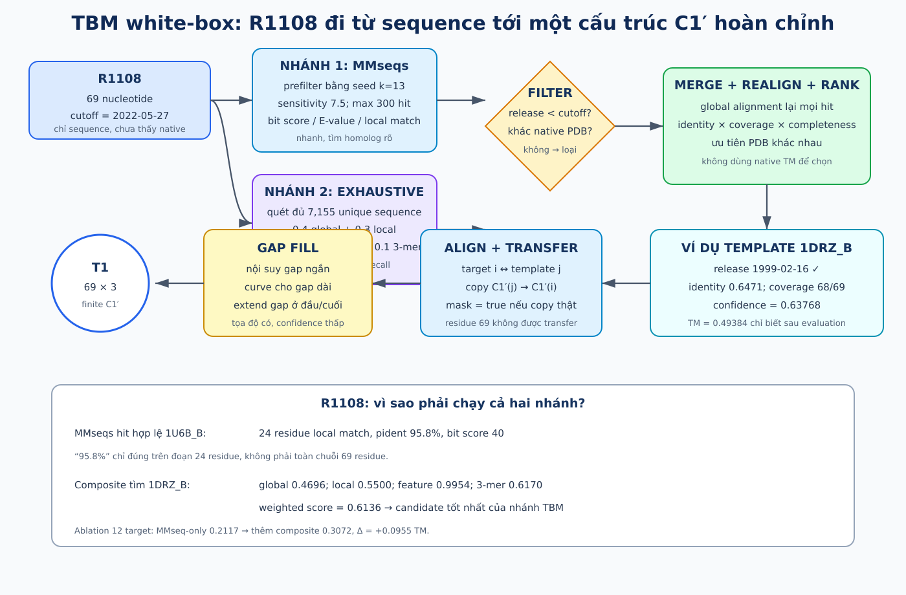
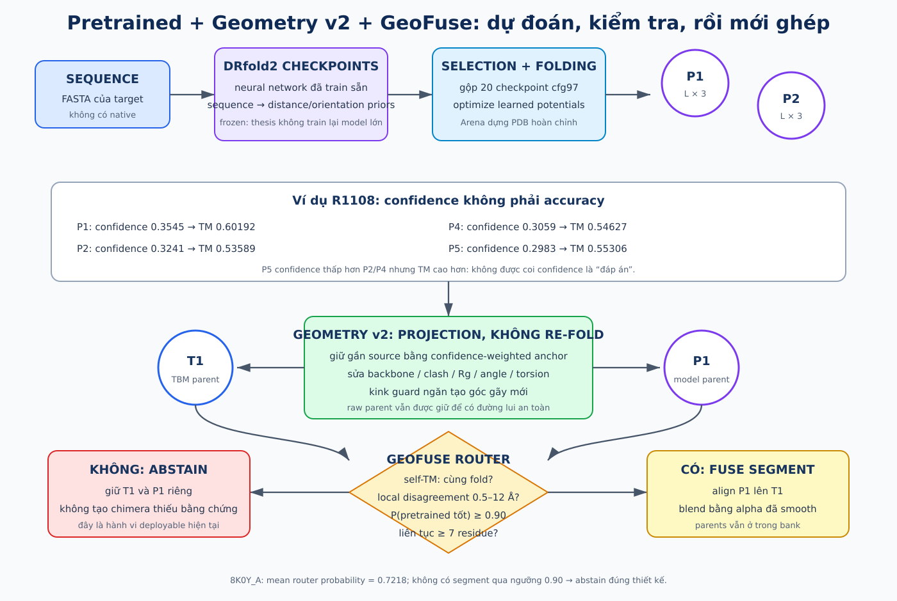
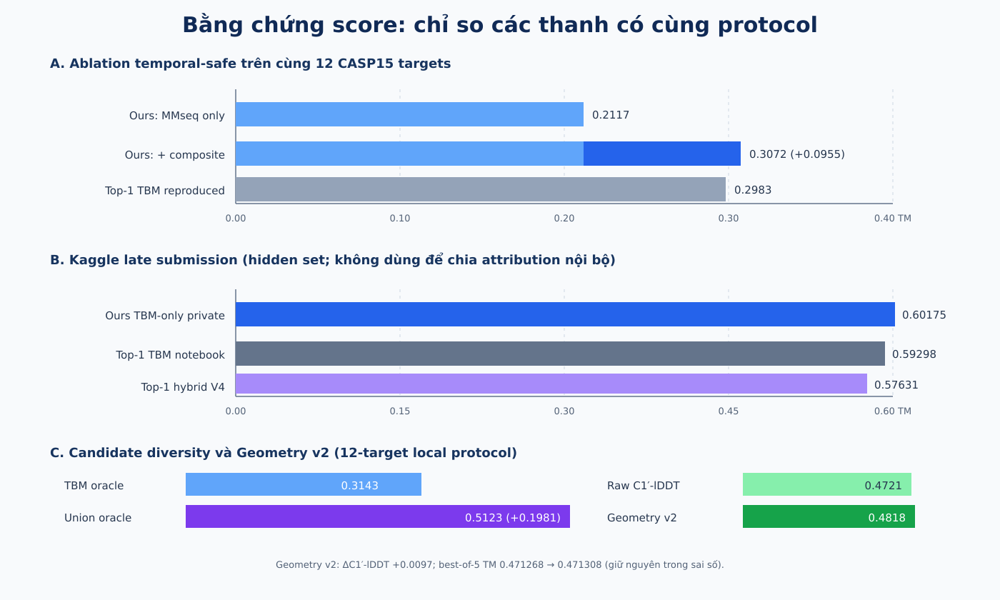

# RNA 3D final pipeline — white-box từ sequence đến submission

> **Mục đích của tài liệu.** Đây là bản giải thích đúng một đường chạy cuối, không phải
> nhật ký mọi thử nghiệm đã từng làm. Mỗi block đều trả lời bốn câu: nhận gì, tính gì,
> quyết định gì, trả ra gì. Những con số gắn nhãn “evaluation” chỉ được tính sau khi
> prediction đã hoàn tất; chúng không được dùng để chọn cấu trúc lúc inference.

## 1. Pipeline làm gì trong một câu?

Cho một chuỗi RNA và mốc thời gian được phép sử dụng dữ liệu, pipeline:

1. tìm các RNA cũ có thể làm **template**;
2. xin thêm các giả thuyết cấu trúc từ **DRfold2 pretrained**;
3. sửa nhẹ hình học cục bộ bằng **Geometry v2**, không đổi fold một cách tùy tiện;
4. chỉ ghép TBM với pretrained khi **GeoFuse** có đủ bằng chứng theo từng đoạn;
5. nếu không đủ bằng chứng thì **abstain** — từ chối ghép và giữ nguyên các cấu trúc cha;
6. chọn năm cấu trúc vừa đáng tin vừa khác nhau và ghi ra `submission.csv`.



Đầu vào và đầu ra cho target dài `L`:

```text
INPUT
  target_id
  sequence: L ký tự A/U/G/C
  temporal_cutoff

OUTPUT
  5 structures × L residues × 3 tọa độ C1′
  shape = [5, L, 3]
```

Vị trí tuyệt đối trong không gian không quan trọng: quay hoặc tịnh tiến cả cấu trúc vẫn
là cùng một hình dạng. Điều cần dự đoán là quan hệ hình học tương đối giữa các nucleotide.

## 2. Hai ví dụ thật dùng trong tài liệu

### Ví dụ A — R1108 cho TBM, pretrained và metric

```text
target_id:       R1108
length:          69 nucleotide
temporal_cutoff: 2022-05-27
sequence:
GGGGGCCACAGCAGAAGCGUUCACGUCGCGGCCCCUGUCAGCCAUUGCACUCCGGCUGCGAAUUCUGCU
```

R1108 là target validation CASP15. Nó phù hợp để giải thích search vì:

- raw database có template gần như native nhưng chúng phải bị loại bởi ngày/self-filter;
- MMseqs tìm được các đoạn giống ngắn;
- exhaustive composite tìm thêm `1DRZ_B`, template tốt mà nhánh nhanh bỏ sót;
- DRfold2 tạo một candidate tốt hơn TBM trên target này.

### Ví dụ B — 8K0Y_A cho GeoFuse confirmatory

```text
target_id:       8K0Y_A
length:          56 nucleotide
temporal_cutoff: 2025-01-15
sequence:
GACGCCGGUGGUGGCACUCCUGGUUUUCAGGACGGGGUUCAAUUCCCUGCGGUGUC
```

GeoFuse được kiểm tra confirmatory trên một cohort mới hơn, post-2023 và
family/temporal-safe. Vì vậy phần fusion dùng `8K0Y_A`, không tráo kết quả từ R1108 vào
protocol mới.

## 3. Data thực sự có gì?

### 3.1 Competition tables

| Data | Nội dung | Có được dùng lúc inference? |
|:--|:--|:--|
| `*_sequences.csv` | ID, chuỗi, cutoff, mô tả | Có |
| `train_labels*.csv` | C1′ coordinates của RNA cũ | Chỉ để học prior/calibration hợp lệ |
| `validation_labels.csv` | native của validation | Không; chỉ mở sau để chấm |
| `test_sequences.csv` | sequence phải predict | Có |
| `sample_submission.csv` | đúng schema và thứ tự dòng | Có |

**Native** là cấu trúc thực nghiệm dùng làm đáp án đánh giá. “Không nhìn native” nghĩa là
không đọc tọa độ của chính target khi tạo/chọn prediction.

### 3.2 PDB_RNA template library

PDB là kho cấu trúc đại phân tử đã được giải bằng thực nghiệm. Mỗi file CIF có nhiều
chain; pipeline parse thành:

```text
chain_key
pdb_id
RNA sequence
C1′ coordinates
resolved mask
release_date
polymer metadata
```

Audit hiện có:

```text
8,670 CIF
→ 23,869 RNA hoặc RNA–DNA chains
→ khoảng 10.86 triệu residues
```

Artifact của kernel Kaggle chứa khoảng 20,844 chain tìm được bằng MMseqs và một library
composite đã khử trùng sequence gồm 7,155 entry. Các số khác nhau vì đây là hai artifact
search với luật lọc/dedup khác nhau, không phải hai “train set” mâu thuẫn.

### 3.3 Dữ liệu nào không đi vào pipeline cuối?

MSA có trong competition data nhưng TBM của repo không dùng MSA. DRfold2 runner dùng
đúng input mà model/checkpoint của nó yêu cầu; tài liệu không claim rằng MSA là một block
riêng của TBM.

## 4. Chuẩn bị offline một lần

“Offline” nghĩa là làm trước khi một target test cụ thể được đưa vào dự đoán.

```text
PDB_RNA/*.cif ──parse──> template metadata + sequence + C1′ coords
                                  │
                                  ├──> MMseqs nucleotide DB
                                  └──> deduplicated composite library

temporal-safe old labels ──statistics──> Geometry v2 priors

DRfold2 repository + checkpoints ──────> frozen pretrained runner
```

Hai nguyên tắc chống leakage:

- template phải có `release_date < target.temporal_cutoff`;
- PDB được khai báo là structure/reference của chính target phải bị loại.

Với pretrained evaluation, repo còn audit cutoff huấn luyện structural của model và
family overlap. Đây là lý do tập confirmatory mới hơn được chia theo thời gian và family.

# 5. TBM white-box

**TBM — Template-Based Modeling**: dự đoán cấu trúc target bằng cách tìm một RNA đã biết,
align hai sequence, rồi chuyển hình dạng của template sang target.



## 5.1 Bước T1 — nhận target

TBM nhận:

```text
R1108 sequence, L = 69
cutoff = 2022-05-27
exclude PDB IDs = các reference ID của R1108
```

Nó chưa đọc `validation_labels` của R1108.

## 5.2 Bước T2 — MMseqs prefilter

### K-mer là gì?

**K-mer** là đoạn con liên tiếp dài `k`. Dùng `k=3` để minh họa:

```text
sequence: G G G G G C C
3-mers:   GGG, GGG, GGG, GGC, GCC
```

Code thật dùng `k=13`, không phải 3. Một seed dài hơn ít xuất hiện ngẫu nhiên hơn nhưng
có thể bỏ sót họ hàng xa; seed ngắn tăng recall nhưng tốn RAM/thời gian và sinh nhiều hit.

MMseqs dùng prefilter seed để thu hẹp database rồi tạo alignment ứng viên. Không nên mô
tả nó là “chỉ lấy giao của các exact k-mer”: implementation MMseqs còn có scoring và
alignment nội bộ. K-mer ở đây là trực giác đúng cho bước tìm seed, không phải toàn bộ
thuật toán.

### Tham số thực tế

```text
search type       = nucleotide
k                 = 13
sensitivity       = 7.5
maximum hits      = 300
E-value threshold = 100
memory cap        = 3 GB
```

`k=13` được chọn vì nucleotide index mặc định `k=15` không vừa máy cũ khoảng 5 GB RAM.
Mục tiêu của nhánh này là mở một lưới candidate đủ rộng; mọi hit tốt sẽ được realign lại
ở bước sau.

### MMseqs trả gì?

Mỗi dòng `.m8` có:

| Field | Nghĩa |
|:--|:--|
| `pident` | % ký tự giống nhau trong **đoạn alignment**, không phải toàn target |
| `alnlen` | độ dài đoạn alignment |
| `qstart/qend` | đoạn tương ứng trên query |
| `tstart/tend` | đoạn tương ứng trên template |
| `bits` | bit score; lớn hơn thường là bằng chứng sequence mạnh hơn |
| `evalue` | số hit tốt tương tự kỳ vọng do ngẫu nhiên; nhỏ hơn thường tốt hơn |

R1108 có raw hit:

| Hit | Raw evidence | Vì sao giữ/loại? |
|:--|:--|:--|
| `7QR3_C/D` | 100%, 69/69, bits 125 | direct/self structure → loại |
| `7QR4_B` | 98.5%, bits 121 | release 2022-10-26 sau cutoff → loại |
| `3BO2_B`, `1ZZN_B`, `1U6B_B`, … | 95.8% trên 24 residue, bits 40 | cũ hơn cutoff → giữ để realign |

Đoạn local 24 residue của `1U6B_B`:

```text
R1108:   UCAGCCAUUGCACUCCGGCUGCGA
1U6B_B:  GCAGCCAUUGCACUCCGGCUGCGA
```

`95.8%` ở đây không có nghĩa hai chuỗi dài 69 giống nhau 95.8%. Sau global realignment,
các candidate nhóm này có identity khoảng 0.5882 và coverage `68/69 = 0.9855`.

## 5.3 Bước T3 — exhaustive composite search

**Exhaustive search** ở đây là tính similarity của query với mọi entry hợp lệ trong
library 7,155 unique sequences, thay vì chỉ xem shortlist do MMseqs trả về.

Mỗi pair nhận bốn score:

<div class="equation">S = 0.4 S<sub>global</sub> + 0.3 S<sub>local</sub> + 0.2 S<sub>feature</sub> + 0.1 S<sub>3-mer</sub></div>

- **Global alignment**: bắt đầu–kết thúc toàn chuỗi; trả lời “hai chuỗi giống nhau tổng
  thể đến đâu?”.
- **Local alignment**: tìm đoạn con giống nhất; trả lời “có motif/đoạn nào rất giống
  không?”.
- **RNA feature cosine**: cosine similarity giữa vector thành phần A/U/G/C,
  dinucleotide, GC/AU, purine/pyrimidine, entropy, length, repeat content.
- **3-mer Jaccard**: `|A ∩ B| / |A ∪ B|` trên tập các đoạn 3 ký tự.

Đây là search **high-recall**: mục tiêu là không bỏ lỡ một template xa nhưng có fold hữu
ích. Nó không chứng minh hai RNA có cùng chức năng sinh học.

Với R1108, composite tìm `1DRZ_B`:

```text
release date        1999-02-16          → temporal-safe
global score        0.4696
local score         0.5500
RNA-feature cosine  0.9954
3-mer Jaccard       0.6170
weighted score      0.6136
```

## 5.4 Bước T4 — temporal/self filter

Với từng template:

```text
if release_date >= cutoff: drop
if pdb_id belongs to target/reference: drop
else: keep
```

Phải dùng dấu `<` nghiêm ngặt. Một cấu trúc công bố đúng hoặc sau ngày target không được
giả vờ là đã tồn tại tại thời điểm dự đoán.

## 5.5 Bước T5 — merge, realign và rank

MMseqs và composite là hai nhánh độc lập:

```text
MMseqs shortlist ───┐
                    ├── union → deduplicate → global realign → rank
composite shortlist ┘
```

Code không rank cuối bằng raw bit score hay raw composite score. Nó global-align lại
target/template bằng:

```text
match +2
mismatch -1
gap open -6
gap extend -0.5
end gaps unpenalized
```

Gap ở đầu/cuối không bị phạt cho phép một template partial nhưng có đoạn hỗ trợ dài vẫn
được dùng.

Sau realignment:

<div class="equation">confidence = identity × coverage × completeness</div>

- `identity`: số nucleotide giống / số cột alignment không gap;
- `coverage`: số target residue nhận C1′ thật / `L`;
- `completeness`: số template residue có C1′ / chiều dài template.

Với `1DRZ_B`:

```text
identity       = 0.6471
coverage       = 68/69 = 0.9855
completeness   = 1.0000
confidence     = 0.63768
```

TM = 0.49384 của candidate này chỉ được biết sau evaluation. Nó không tham gia công thức
confidence.

## 5.6 Bước T6 — alignment và chuyển tọa độ

Alignment tạo mapping:

```text
target residue i  ↔  template residue j
```

Nếu `j` có tọa độ C1′ hữu hạn:

```text
target_coords[i] = template_coords[j]
support_mask[i]  = true
```

Nếu target có insertion, hoặc C1′ ở template không resolved:

```text
target_coords[i] = NaN tạm thời
support_mask[i]  = false
```

`support_mask` trả lời “tọa độ này có bằng chứng trực tiếp từ template không?”. Nó quan
trọng hơn một kiểm tra `isfinite`: gap-fill cũng tạo số hữu hạn nhưng bằng chứng yếu hơn.

Với `1DRZ_B`, residue 1–68 được transfer; residue 69 không có template partner.

## 5.7 Bước T7 — gap filling

Submission không được chứa NaN, nên gap phải được dựng:

| Loại gap | Cách dựng | Confidence |
|:--|:--|:--|
| internal ngắn | nội suy giữa hai điểm hai bên | thấp, giảm vào giữa gap |
| internal dài | nội suy + độ cong sinus vuông góc | thấp |
| terminal | kéo theo hướng backbone gần nhất, khoảng 6 Å | 0.1 |
| không có điểm nào | extended chain fallback | 0 |

Gap-fill là “tạo tọa độ hợp lệ để pipeline chạy”, không phải tuyên bố đoạn đó đúng.

## 5.8 Bước T8 — chọn nhiều template

Candidate được sort theo confidence. Pipeline lấy PDB khác nhau trước rồi mới backfill.
Lý do: Kaggle chấm best-of-5; năm chain gần như trùng từ một PDB ít hữu ích hơn nhiều fold
hypothesis.

R1108 khi bật composite chọn `1DRZ_B` trước nhóm partial MMseqs. Ablation cùng code,
cùng 12 target:

```text
MMseqs-only                 0.2117
MMseqs + exhaustive        0.3072
delta                      +0.0955 TM
top-1 TBM reproduction     0.2983
ours - reproduction        +0.0089
```

Trên riêng R1108:

```text
MMseqs-only best-of-5      0.3124
+ composite                0.4889
delta                      +0.1765
top-1 reproduction         0.4767
```

Đây là attribution hợp lệ vì chỉ một block bị bật/tắt trên cùng target/protocol.

## 5.9 TBM-only đã được submit gì?

Late submission private/public `0.60175/0.60084` là kernel **TBM-only của repo**, không có
DRfold2, Boltz hay GeoFuse. Đường chạy đã submit:

```text
MMseqs + composite
→ temporal/self filter
→ realign/rank/distinct PDB
→ coordinate transfer + gap-fill
→ confidence-weighted geometry cleanup, 300 Adam steps
→ validate submission.csv
```

Nó cao hơn TBM-only notebook được báo cáo `0.59298` một lượng `+0.00877`, gần với chênh
lệch local `+0.0089`. Tuy nhiên hidden Kaggle set khác 12 CASP15; không cộng/trừ hai score
này với nhau để suy ra contribution.

# 6. Pretrained white-box

**Pretrained model** là model đã học pattern từ một tập dữ liệu trước đó. “Frozen” nghĩa
là checkpoint không đổi trong thesis inference; repo không train lại một foundation
model RNA 3D từ đầu.



## 6.1 DRfold2 thực hiện gì?

Khái niệm chính:

- **checkpoint**: snapshot trọng số neural network;
- **learned restraint/potential**: model dự đoán các quan hệ như distance/orientation
  có khả năng xảy ra giữa residue;
- **folding/optimization**: tìm tọa độ 3D có energy thấp theo các restraint đó;
- **model confidence**: ước lượng nội bộ, không phải native TM.

Runner của repo:

1. ghi sequence target thành FASTA;
2. chạy 20 checkpoint của cấu hình `cfg97`;
3. mỗi checkpoint dự đoán prior/potential từ sequence;
4. selection gộp thông tin checkpoint;
5. PotentialFold tối ưu cấu trúc coarse-grained;
6. Arena tạo PDB hoàn chỉnh;
7. đọc C1′ coordinates và confidence;
8. giữ các hypothesis đứng đầu.

Đầu ra cũng được chuẩn hóa thành:

```text
target_id, sequence
coords[L,3]
confidence[L]
support_mask[L]
source/model/checkpoint provenance
```

## 6.2 Confidence không phải “độ đúng”

R1108 có:

| Candidate | DRfold confidence | Native TM sau evaluation |
|:--|--:|--:|
| P1 | 0.3545 | 0.60192 |
| P2 | 0.3241 | 0.53589 |
| P3 | 0.3166 | 0.48550 |
| P4 | 0.3059 | 0.54627 |
| P5 | 0.2983 | 0.55306 |

P5 confidence thấp hơn P2/P3/P4 nhưng TM cao hơn cả ba. Trên 55 DRfold2 candidates,
pooled Spearman confidence–TM là 0.486 nhưng mean within-target chỉ -0.036. Vì vậy không
được sort chung TBM và DRfold2 bằng raw confidence rồi gọi đó là quality.

## 6.3 Vì sao pretrained vẫn cần?

Trên 12 target:

```text
TBM oracle                  0.3143
pretrained oracle           0.4972
union oracle                0.5123
union - TBM                 +0.1981
native-blind selected union 0.4713
```

**Oracle** ở đây chỉ là diagnostic sau evaluation: chọn candidate có TM cao nhất nếu đã
biết native. Nó đo “candidate bank có chứa lời giải tốt không”, không phải method có thể
deploy. `0.4713` mới là mức selection native-blind đạt được trong protocol này.

R1108:

```text
best TBM       1DRZ_B, TM = 0.49384
best DRfold2   P1,     TM = 0.60192
union gain             = +0.10808
```

Một final-five source-balanced thật của R1108 là:

```text
T(1DRZ_B), P1, T(5V7Q_B), P2, T(1U6B_B)
```

## 6.4 Boltz nằm ở đâu?

Boltz đã được dùng trong feasibility Phase A cho `R1138` dài 720 nucleotide khi DRfold2
vượt giới hạn GPU 16 GB:

```text
R1138 TBM  0.2243
Boltz      0.2751
gain      +0.0508
```

Nhưng final confirmatory cohort dài ≤100 dùng DRfold2 thống nhất. Vì vậy Boltz là
fallback/pretrained evidence cho target dài, không phải block mặc định trong đường chạy
final được vẽ.

# 7. Geometry v2 white-box

Mục tiêu của Geometry v2 không phải dựng một fold mới. Nó là **projection bảo thủ**:
dịch tọa độ vừa đủ để hình học C1′ cục bộ hợp lý hơn, trong khi anchor mạnh giữ candidate
gần cấu trúc nguồn.

## 7.1 Priors được học thế nào?

Từ các structure cũ hợp lệ, pipeline đo:

- C1′–C1′ distance liên tiếp;
- pseudo-angle của ba C1′ liên tiếp;
- signed pseudo-torsion của bốn C1′ liên tiếp;
- radius of gyration `Rg`;
- non-local clash;
- context `pair_like` hoặc `unpaired`.

`pair_like` không phải annotation base pair thật. Nó là proxy inference-time: hai base
thuộc AU/UA/GC/CG/GU/UG, cách nhau ít nhất bốn vị trí sequence và có C1′ distance quanh
10.5±2.5 Å. Tên proxy được giữ để không claim quá mức sinh học.

Angle/torsion được lưu thành histogram probability; negative log-likelihood thấp nghĩa là
hình học giống phân bố của RNA cũ hơn.

## 7.2 Objective được tối ưu

Với source coordinates `X₀`, Geometry v2 tìm `X` nhỏ nhất:

<div class="equation">ℒ(X) = 3.0 L<sub>source</sub> + s (1.0 L<sub>backbone</sub> + 0.3 L<sub>clash</sub> + 0.02 L<sub>Rg</sub> + 0.30 L<sub>angle</sub> + 0.15 L<sub>torsion</sub> + 20 L<sub>kink</sub>)</div>

Trong đó:

- `source`: Huber distance từ `X` về `X₀`, weighted bằng confidence;
- `backbone`: adjacent distance theo empirical prior;
- `clash`: phạt điểm non-neighbour quá gần;
- `Rg`: phạt kích thước global quá xa RNA cùng chiều dài;
- `angle/torsion`: phạt hình học hiếm theo context;
- `kink`: constraint ngăn tạo/worsen sharp local kink;
- `s = 0.2 + 0.8(1 - global_confidence)`: candidate yếu được phép sửa mạnh hơn.

Tối ưu dùng Adam, 300 steps, learning rate 0.04 và gradient clipping. Raw parent luôn
được giữ, nên projection không xóa đường lui.

## 7.3 Bằng chứng module

Trên 12 target, cùng 60 selected candidates:

```text
                     raw          Geometry v2      delta
best-of-5 TM         0.471268     0.471308         +0.000040
C1′-lDDT             0.472117     0.481823         +0.009706
window-9 RMSD (Å)    4.00131      3.94415          -0.05716
```

Geometry v2 cải thiện C1′-lDDT trên 12/12 targets và giữ TM trong tolerance đã đăng ký.
Đây là claim chính xác: **cải thiện local distance preservation mà không làm thay đổi
global score có ý nghĩa**. Không claim Geometry v2 tăng Kaggle private score vì chưa có
GeoFuse/Geometry-v2 private submission.

# 8. GeoFuse white-box

GeoFuse kiểm tra idea: “đoạn TBM tốt thì giữ, đoạn pretrained tốt thì thay”. Điểm khó là
inference không có native để biết bên nào tốt. Câu trả lời của pipeline là một router
được train/calibrate ngoài target và có quyền từ chối.

## 8.1 OOF là gì?

**OOF — out-of-fold** prediction là prediction cho một target được tạo bởi model/calibrator
không được train trên chính fold/family chứa target đó. Repo kết hợp:

- time split: train cũ, calibration mới hơn, confirmatory mới nhất;
- family clustering: sequence gần nhau không rơi vào hai phía train/eval;
- pretrained structural-cutoff audit;
- template release/self audit.

Mục đích: confidence router phải gặp target “chưa biết”, giống deployment hơn train fit.

## 8.2 Bước G1 — cluster theo global fold

Pipeline tính self-TM giữa candidate với candidate, không cần native, rồi cluster ở
threshold đã freeze 0.35.

Chỉ pair:

```text
one template + one pretrained
trong cùng global-fold cluster
```

mới được cân nhắc. Hai nguồn khác fold không được cắt/ghép với nhau.

## 8.3 Bước G2 — robust superposition và local disagreement

Pretrained parent được rigid-align lên template parent bằng các residue:

```text
finite ở hai bên
+ template có support
+ template confidence ≥ 0.25
```

Sau align:

<div class="equation">disagreement<sub>i</sub> = ‖P̂<sub>i</sub> − T<sub>i</sub>‖<sub>2</sub></div>

và smooth bằng cửa sổ 15 residue. Disagreement chỉ nói hai nguồn khác nhau bao nhiêu,
không nói nguồn nào đúng.

## 8.4 Bước G3 — router dự đoán source tốt hơn

Router nhận feature native-blind của pair: source confidence, support, disagreement,
candidate geometry và context prior. Nó trả:

<div class="equation">p<sub>i</sub> = P(pretrained tốt hơn tại residue i)</div>

Điều kiện switch đã freeze:

```text
p_i ≥ decision_threshold 0.75 + margin 0.15 = 0.90
0.5 Å ≤ local disagreement ≤ 12 Å
ít nhất 7 residue liên tục cùng qua gate
```

Tại sao cần 7 residue liên tục? Một điểm confidence cao đơn lẻ dễ là nhiễu; một đoạn
liên tục có ý nghĩa cấu trúc hơn và giảm seam do đổi nguồn liên tục.

## 8.5 Bước G4 — selective fusion hoặc abstain

Nếu có segment hợp lệ, binary switch được Gaussian smooth thành `αᵢ ∈ [0,1]`:

<div class="equation">X<sub>i</sub><sup>fused</sup> = (1 − α<sub>i</sub>) T<sub>i</sub> + α<sub>i</sub> P̂<sub>i</sub></div>

Nhờ smooth, boundary không nhảy đột ngột. Geometry v2 có thể project fused candidate,
nhưng hai raw parents vẫn còn trong bank.

Nếu không có segment hợp lệ:

```text
return None
→ không tạo fused candidate
→ giữ raw parents
```

Đây là **abstention**, một quyết định hợp lệ của thuật toán chứ không phải crash.

## 8.6 Ví dụ 8K0Y_A

Raw bank:

| Source | Candidate | Global confidence |
|:--|:--|--:|
| TBM | `8V1I_B` | 0.9107 |
| TBM | `8V1H_A` | 0.8571 |
| TBM | `4KR3_C` | 0.6786 |
| DRfold2 | P1 | 0.4969 |
| DRfold2 | P2 | 0.4849 |

Self-TM tạo hai cluster; một cluster mixed chứa `8V1I_B` và P1:

```text
alignment RMSD                 1.099 Å
mean point disagreement       2.855 Å
mean window disagreement      2.853 Å
p90 window disagreement       5.529 Å
mean P(pretrained better)     0.7218
```

Không có run ≥7 residue cùng vượt 0.90, nên selective GeoFuse abstain. Raw final five
đạt:

```text
TM       0.65667
C1′-lDDT 0.87125
```

Một heuristic fusion không deployable-default cải thiện riêng target này lên TM 0.66255,
nhưng aggregate confirmatory không ổn định. Frozen quality-gated method chọn an toàn và
không thay raw parent.

## 8.7 Kết quả confirmatory của GeoFuse

Trên 20 newest validation targets:

```text
F0 raw selected TM              0.588304
quality-gated GeoFuse TM        0.588304
delta                           0.000000
quality-gated fused candidates  0
```

Kết luận đúng:

- router hiện tại chưa chứng minh được selective fusion generalize;
- abstention ngăn regression vật chất;
- final deployable behavior hiện tại là giữ bank cha khi thiếu bằng chứng;
- thesis contribution là protocol/router có fail-safe và kết quả âm trung thực, không
  phải claim rằng fusion đã tăng TM.

# 9. Chọn final five và ghi submission

## 9.1 Native-blind selection

Candidate bank được đánh giá bằng feature không dùng native. Selection:

1. giữ fold diversity theo self-TM cluster;
2. không để raw confidence scale của một source xóa source kia;
3. ưu tiên quality/diversity;
4. giữ tối đa năm candidate;
5. nếu GeoFuse abstain, chọn trực tiếp từ raw/Geometry-v2 bank.

Native TM chỉ được đọc sau khi list năm ID đã freeze.

## 9.2 Schema

Mỗi nucleotide là một row:

```text
ID,resname,resid,
x_1,y_1,z_1,
x_2,y_2,z_2,
...
x_5,y_5,z_5
```

Sanity checks:

- đúng toàn bộ ID như sample;
- đúng thứ tự row;
- residue chạy từ 1 tới `L`;
- `resname` khớp sequence;
- đủ năm conformations;
- tất cả coordinate hữu hạn;
- không duplicate ID.

## 9.3 Trạng thái submission cần nói rõ

| Artifact | Đã chạy? | Score |
|:--|:--|:--|
| TBM-only kernel | Đã late-submit Kaggle | private 0.60175; public 0.60084 |
| TBM + DRfold2 + Geometry v2 + GeoFuse | Đã local/confirmatory evaluation theo module | **chưa submit private Kaggle** |

Không được gọi `0.60175` là score của hybrid/GeoFuse.

# 10. Người ta làm gì, mình dùng lại gì, cái gì mới?



## 10.1 Top-1 TBM notebook

Notebook TBM dùng:

- exhaustive composite similarity;
- global/local alignment, RNA features, 3-mer;
- KMeans/farthest clustering để đa dạng hóa;
- coordinate transfer, rule-based gap fill/refine;
- de-novo fallback.

Repo port lại để có baseline. Reproduction temporal-safe trên 12 target đạt 0.2983.

## 10.2 Top-1 hybrid notebook

Captured hybrid V4:

- chạy Boltz tạo structure;
- dùng Boltz như AF3-style restraint cho DRfold2 trên một subset;
- template fallback cho target còn lại;
- với một số RNA dài, thay một conformation bằng Boltz.

Nó không thực hiện confidence-aware local fusion. Reported score V4 là 0.57631. Transcript
cũng có các vấn đề selection/index/placeholder, nên score đó không chứng minh pretrained
về bản chất kém hơn TBM.

## 10.3 Phần kế thừa và phần của thesis

| Block | Nguồn ý tưởng | Thesis làm gì thêm? |
|:--|:--|:--|
| composite search | top-1 TBM | ghép với MMseqs, temporal/self-safe, rank lại |
| coordinate transfer/gap fill | TBM chuẩn + top-1 | support mask và per-residue confidence rõ ràng |
| candidate diversity | best-of-5/top-1 | distinct PDB + source/fold-aware bank |
| DRfold2/Boltz | model công bố sẵn | audit, normalize provenance, OOF candidate evaluation |
| Geometry v2 | contribution thesis | context-aware angle/torsion, strong source anchor, kink guard |
| GeoFuse router | contribution thesis | same-fold local gate, calibrated margin, contiguous segment, abstention |
| evaluation | competition + thesis | TM + C1′-RMSD + C1′-lDDT + sliding-window RMSD, target bootstrap |

Claim nên dùng:

> Pipeline temporal-safe kết hợp template và pretrained candidates làm tăng fold coverage.
> Geometry v2 cải thiện local C1′ distance preservation trong khi giữ global TM. Selective
> GeoFuse hiện chưa generalize; abstention giữ nguyên raw bank và ngăn fusion thiếu bằng
> chứng.

Không nên claim:

- “GeoFuse đã tăng Kaggle private TM”;
- “router biết chắc đoạn nào đúng”;
- “pair_like là base-pair annotation thật”;
- “confidence của DRfold2 tương đương confidence TBM”;
- “0.60175 chứng minh toàn bộ hybrid pipeline”.

# 11. Pseudocode cuối

```text
for target in test_sequences:
    assert cutoff exists

    mm_hits  = mmseqs_search(target.sequence, k=13)
    comp_hits = exhaustive_composite_search(target.sequence)
    hits = temporal_and_self_filter(mm_hits ∪ comp_hits, target)

    tbm = []
    for template in realign_and_rank(hits):
        transferred, support = copy_C1_coordinates(template, target)
        filled, confidence = gap_fill(transferred, support)
        tbm.append(normalize_candidate(filled, confidence, support))
    tbm = distinct_PDB_top3(tbm)

    pretrained = DRfold2_frozen(target.sequence, top2=True)
    raw = normalize(tbm + pretrained)

    augmented = keep(raw)
    geometry_v2_candidates = conservative_projection(raw)
    augmented += geometry_v2_candidates

    clusters = self_TM_cluster(raw, threshold=0.35)
    for same_fold(T, P) in mixed_source_pairs(clusters):
        probability = quality_router(T, P)
        segment = contiguous(
            probability >= 0.90
            and 0.5 <= local_disagreement <= 12,
            minimum=7
        )
        if segment exists:
            fused = smooth_segment_fusion(T, P, segment)
            augmented += [fused, geometry_v2(fused)]
        else:
            abstain

    final5 = native_blind_quality_diversity_select(augmented)
    write_target_rows(final5)

validate_against_sample_submission()
```

Pseudocode trên mô tả design cuối. Artifact Kaggle hiện đã submit mới chỉ đi qua nhánh
TBM-only nêu ở §5.9.

# 12. Glossary ngắn

| Thuật ngữ | Nghĩa đơn giản |
|:--|:--|
| candidate | một giả thuyết cấu trúc |
| chain | một chuỗi polymer trong file PDB/CIF |
| checkpoint | bộ trọng số model tại một thời điểm |
| confidence | ước lượng native-blind; không phải accuracy thật |
| exhaustive | duyệt toàn bộ library hợp lệ |
| fold | bố cục/hình dạng 3D tổng thể |
| gap | vị trí không map được giữa target và template |
| homolog | sequence có quan hệ tiến hóa/tương đồng đáng kể |
| inference | tạo prediction cho input mới |
| k-mer | đoạn sequence liên tiếp dài `k` |
| native | cấu trúc thực nghiệm làm reference |
| OOF | prediction cho target ngoài fold train/calibration của nó |
| pretrained | model đã được train trước |
| prior | phân bố/kiến thức thống kê có từ trước |
| refinement/projection | sửa tọa độ từ một candidate có sẵn |
| restraint | điều kiện/energy khuyến khích quan hệ hình học |
| temporal-safe | chỉ dùng thông tin đã tồn tại trước cutoff |
| template | cấu trúc đã biết dùng để chuyển sang target |
