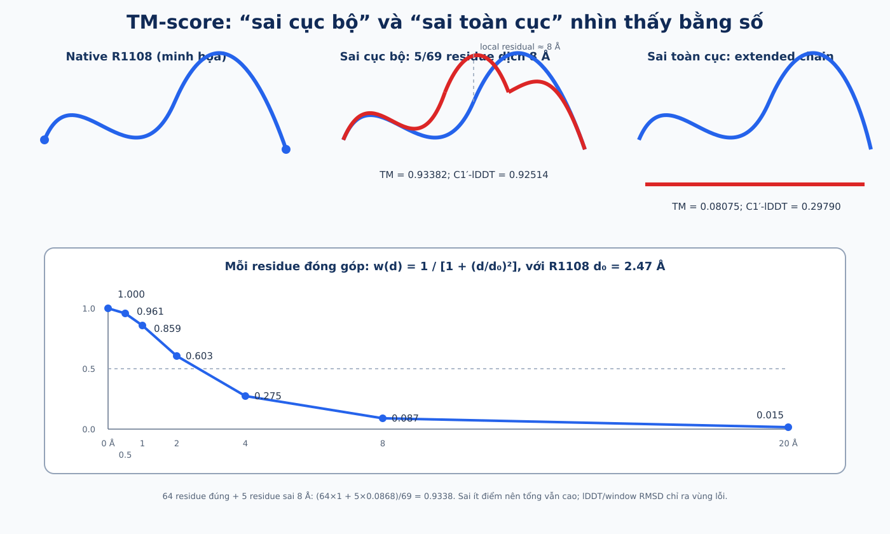

# TM-score và bộ metric bảo vệ thesis — công thức, ví dụ và sanity-check

> Tài liệu này trả lời trực tiếp: “global tốt là tốt thế nào?”, “sai cục bộ là sai bao
> nhiêu?”, “vì sao TM vẫn cao?”, và “metric độc lập nào chứng minh Geometry v2 thực sự sửa
> local structure?”.

# 1. Competition chấm chính xác thế nào?

Repo mirror official scorer:

1. ghi prediction và native thành PDB chỉ có atom C1′;
2. chạy `USalign prediction.pdb native.pdb -atom " C1'"`;
3. lấy TM-score thứ hai — normalized theo chiều dài native/reference;
4. với một target, lấy giá trị tốt nhất trong:

<div class="equation">5 predictions × N<sub>native conformations</sub></div>

5. competition score là mean bằng nhau trên các target.

Trong code:

```text
target_score = max(TM(pred_k, ref_j))  với k=1..5, j=1..Nref
final_score  = mean(target_score)
```

Đây là lý do pipeline phải tạo năm cấu trúc đa dạng: chỉ một cấu trúc cần match một
native conformation tốt để target nhận score đó.

US-align paper mô tả TM-score cho RNA bằng nucleotide representative atom và ngưỡng cùng
topology khoảng 0.45. Competition override atom thành C1′; repo làm đúng override này.
Nguồn: [US-align paper](https://pmc.ncbi.nlm.nih.gov/articles/PMC9557024/).

# 2. Trước khi tính score: phải align 3D

Hai cấu trúc có thể giống hệt nhưng:

- một cấu trúc bị tịnh tiến 100 Å;
- hoặc quay 90°;

thì vẫn phải score 1.0. US-align tìm correspondence/alignment và rigid transformation:

```text
rotation + translation
```

để superpose prediction lên native. Khoảng cách `dᵢ` chỉ được đo **sau** bước tối ưu
này. Vì vậy “dịch cả cấu trúc 8 Å” không phải sai fold: alignment sẽ dịch nó trở lại.
“Dịch riêng một loop 8 Å so với phần còn lại” mới để lại local residual.

# 3. Công thức TM-score

<div class="equation">TM = (1/L) Σ<sub>i=1…Lali</sub> 1 / [1 + (d<sub>i</sub>/d<sub>0</sub>(L))<sup>2</sup>]</div>

Trong đó:

- `L`: chiều dài native/reference;
- `Lali`: số residue được structural alignment ghép cặp;
- `dᵢ`: khoảng cách Å giữa cặp C1′ thứ `i` sau superposition;
- `d₀(L)`: thang khoảng cách phụ thuộc chiều dài RNA.

Với nucleic acid dài `L ≥ 30`:

<div class="equation">d<sub>0</sub>(L) = 0.6 √(L − 0.5) − 2.5</div>

Với RNA ngắn, US-align dùng floor piecewise: 0.7 Å cho 24–29, 0.6 cho 20–23, 0.5
cho 16–19, 0.4 cho 12–15 và 0.3 cho ≤11.

Residue không được align đóng góp 0 vì mẫu số vẫn là `L`, không phải `Lali`. Công
thức và normalization được mô tả trong [US-align](https://pmc.ncbi.nlm.nih.gov/articles/PMC9557024/)
và được kiểm tra lại bằng output binary trong repo.

# 4. Ví dụ số bằng tay với R1108

R1108 có `L = 69`:

<div class="equation">d<sub>0</sub> = 0.6 √(69 − 0.5) − 2.5 = 2.4659 Å ≈ 2.47 Å</div>

Mỗi residue nhận weight:

<div class="equation">w(d) = 1 / [1 + (d/2.4659)<sup>2</sup>]</div>

| residual `d` sau align | contribution `w(d)` |
|--:|--:|
| 0 Å | 1.000 |
| 0.5 Å | 0.961 |
| 1 Å | 0.859 |
| 2 Å | 0.603 |
| 4 Å | 0.275 |
| 8 Å | 0.087 |
| 20 Å | 0.015 |



## 4.1 64 residue đúng, 5 residue local sai 8 Å

<div class="equation">TM ≈ [64(1) + 5(0.0868)] / 69 = 64.4338 / 69 = 0.9338</div>

TM vẫn rất cao vì 92.8% residue đóng góp gần 1. Năm residue sai không bị “bỏ qua”:
chúng chỉ đóng góp 0.087 thay vì 1; tổng bị trừ khoảng 0.0662.

## 4.2 34 residue đúng, 35 residue sai 8 Å

<div class="equation">TM ≈ [34(1) + 35(0.0868)] / 69 = 0.5368</div>

Khi quá nửa cấu trúc sai, TM giảm rõ.

## 4.3 Cả 69 residue có residual 8 Å

<div class="equation">TM ≈ 0.0868</div>

Đây phải là residual hình dạng sau optimal alignment, không phải tịnh tiến rigid toàn
cấu trúc.

Vì vậy phát biểu chính xác là:

> TM-score vẫn cao khi đa số residue có vị trí tương đối đúng sau superposition, dù một
> vùng nhỏ có residual lớn. Khi lỗi trải trên phần lớn RNA hoặc nhiều residue không align
> được, tổng contribution giảm mạnh.

# 5. Thực nghiệm phá cấu trúc có kiểm soát

Để không chỉ dựa vào phép tính toy, repo lấy native conformation 2 của R1108 và tạo bốn
prediction:

1. copy native;
2. dịch riêng residue 31–35 thêm 8 Å theo trục x;
3. dịch residue 21–50 thêm 8 Å;
4. thay toàn fold bằng một C1′ trace thẳng, adjacent spacing 5.9 Å.

Sau đó chạy chính US-align C1′ scorer và các metric local của repo:

| Prediction | TM | C1′-RMSD Å | C1′-lDDT | SW-RMSD-9 Å | SW-RMSD-15 Å |
|:--|--:|--:|--:|--:|--:|
| native copied | 1.00000 | 0.000 | 1.0000 | 0.000 | 0.000 |
| 5-residue block +8 Å | 0.93382 | 2.029 | 0.9251 | 0.536 | 0.941 |
| 30-residue domain +8 Å | 0.62387 | 3.815 | 0.7319 | 0.693 | 1.381 |
| straight extended chain | 0.08075 | 114.121 | 0.2979 | 7.611 | 16.687 |

US-align output:

```text
5-residue shift:
Aligned length=69, RMSD=2.03, TM-score=0.93382

30-residue shift:
Aligned length=64, RMSD=3.42, TM-score=0.62387

extended chain:
Aligned length=12, RMSD=3.28, TM-score=0.08075
```

Điểm đáng chú ý ở extended chain: RMSD mà US-align in ra chỉ tính trên 12 residue được
align, nên vẫn là 3.28 Å; TM normalized theo đủ 69 residue nên chỉ 0.08075. Đây là ví dụ
thực tế vì sao không đọc RMSD một mình mà bỏ alignment coverage.

# 6. Ví dụ prediction thật của R1108

R1108 có hai native conformations. Với TBM `1DRZ_B`:

```text
against native 1: aligned 52, RMSD 3.93 Å, TM 0.36028
against native 2: aligned 49, RMSD 2.93 Å, TM 0.49384  ← target chọn giá trị này
```

Với DRfold2 P1:

```text
against native 1: aligned 67, RMSD 2.93 Å, TM 0.50672
against native 2: aligned 67, RMSD 2.83 Å, TM 0.60192  ← chọn giá trị này
```

DRfold2 P1 không thắng chỉ vì RMSD 2.83 nhỏ hơn 2.93 một chút. Nó align được 67/69
residue, trong khi TBM best alignment có 49/69; phân bố các `dᵢ` cũng khác. TM kết hợp
coverage và residual bằng hàm weight có saturation.

# 7. Các metric độc lập được công nhận

## 7.1 C1′-RMSD

Sau Kabsch superposition trên các C1′ cùng index:

<div class="equation">RMSD = √{(1/N) Σ<sub>i=1…N</sub> ‖P<sub>i</sub> − R<sub>i</sub>‖<sup>2</sup>}</div>

- đơn vị Å;
- 0 là giống hệt;
- outlier bị bình phương nên có thể chi phối;
- phải báo rõ atom selection và residue coverage.

RMSD là metric cấu trúc kinh điển, nhưng một con số global không định vị lỗi.

## 7.2 C1′-lDDT

**lDDT — Local Distance Difference Test** là metric local không cần superposition. Với
mỗi pair C1′ có native distance ≤15 Å, code so:

<div class="equation">Δ<sub>ij</sub> = | ‖P<sub>i</sub> − P<sub>j</sub>‖ − ‖R<sub>i</sub> − R<sub>j</sub>‖ |</div>

Pair nhận:

<div class="equation">pair score = ¼ [𝟙(Δ&lt;0.5) + 𝟙(Δ&lt;1) + 𝟙(Δ&lt;2) + 𝟙(Δ&lt;4)]</div>

Per-residue lDDT là mean pair score quanh residue; global C1′-lDDT là mean per-residue:

- 1: mọi local distance được bảo toàn trong threshold;
- 0: không pair nào được bảo toàn;
- không cần xoay/chồng hai cấu trúc;
- nhạy với môi trường local hơn TM.

lDDT là metric được công bố bởi Mariani et al., không phải repo tự đặt:
[original lDDT paper](https://pmc.ncbi.nlm.nih.gov/articles/PMC3799472/).
Thesis dùng phiên bản **C1′-trace lDDT**, không claim là all-atom lDDT nguyên bản.

## 7.3 Sliding-window C1′-RMSD

Với window `w = 9, 15, 31`:

1. lấy mọi đoạn liên tiếp dài `w`;
2. Kabsch-fit prediction/native riêng trong window đó;
3. tính RMSD window;
4. mean các window hoặc vẽ profile theo residue.

Ví dụ `SW-RMSD-9` của local 5-residue shift là 0.536 Å, trong khi global C1′-RMSD là
2.029 Å. Window quanh vùng 31–35 tăng mạnh; window xa vùng lỗi gần 0.

Sliding-window RMSD là một procedure minh bạch để localize RMSD, không nên gọi nó là
“official RNA metric có một chuẩn duy nhất”. Cần luôn ghi atom C1′, window size và cách
aggregate.

## 7.4 RNA-specific interaction metric

Interaction Network Fidelity (INF) là một metric RNA-specific được dùng để so base
pair/stacking network. Nhưng prediction hiện là C1′-only trace; suy ra base-pair/stacking
all-atom từ C1′ có thể không đáng tin. Vì vậy thesis không dùng INF để claim ở vòng này.
Đây là giới hạn representation, không phải vì INF không hợp lệ.

# 8. “Kink”, “sharp” và geometry diagnostics có phải metric chuẩn?

Không. Trong repo:

- sharp-kink count;
- clash proxy;
- radius-of-gyration deviation;
- angle/torsion negative log-likelihood;
- pair-like fraction;

là **internal diagnostics/loss terms**. Chúng hữu ích để debug optimizer và đặt constraint,
nhưng không được dùng một mình để tuyên bố prediction gần native.

Tên `kink guard` nghĩa là:

```text
nếu angle mới nhỏ hơn lower bound cho phép
→ phạt optimizer
```

Đây là engineering constraint có định nghĩa toán rõ, không phải biomarker biology được
công nhận.

Claim Geometry v2 được bảo vệ bằng:

- competition TM;
- C1′-RMSD;
- C1′-lDDT;
- sliding-window C1′-RMSD;
- paired target bootstrap.

Kink/clash/NLL chỉ là evidence hỗ trợ cơ chế.

# 9. Ablation và claim cuối


| Câu hỏi | Ablation/protocol | Kết quả | Claim hợp lệ |
|:--|:--|:--|:--|
| exhaustive search có thêm giá trị? | MMseqs-only vs +composite, cùng 12 target | 0.2117 → 0.3072, +0.0955 TM | tăng template recall/fold coverage |
| pipeline TBM so top-1 port? | cùng temporal-safe 12 target | 0.3072 vs 0.2983 | +0.0089 trong reproduction này |
| pretrained có thêm fold? | TBM oracle vs union oracle | 0.3143 → 0.5123 | candidate diversity có headroom +0.1981 |
| Geometry v2 sửa local? | raw vs v2, cùng 60 candidate | lDDT +0.0097; TM +0.00004 | local validity tăng, global TM giữ |
| router chọn đúng segment? | frozen 20-target confirmatory | delta 0; 0 selective candidates | chưa generalize; abstain bảo vệ raw |
| Kaggle external score? | một TBM-only late submission | private 0.60175 | TBM artifact chạy tốt trên hidden set |

Không ghép các dòng khác protocol thành một stacked bar “contribution”. Ví dụ không được
nói:

```text
0.3072 + 0.1981 + 0.0097 = final TM
```

`0.1981` là oracle candidate-pool headroom; `0.0097` là lDDT; chúng khác metric và khác
decision rule.

# 10. So sánh score với top-1: cách nói an toàn

```text
Kaggle hidden:
ours TBM-only private         0.60175
reported top-1 TBM notebook  0.59298
reported hybrid V4           0.57631
```

Câu nói đúng:

> Artifact TBM-only của repo cao hơn reported TBM notebook V1 0.00877 trên bảng late
> submission được cung cấp. Local reproduction temporal-safe cũng cho chênh 0.0089.

Câu nói sai:

> GeoFuse của thesis đã đánh bại top-1.

Lý do: GeoFuse chưa có hidden private submission; notebook versions, target set và
artifact không hoàn toàn giống nhau.

# 11. Vì sao chỉ 5 target là ít và logic cohort cuối?

Năm target có thể dùng để:

- smoke test code;
- phát hiện NaN/OOM;
- kiểm tra feature có variation;
- ước lượng sơ bộ runtime.

Nhưng không đủ để kết luận generalization vì một target có trọng số 20%. Confirmatory
fusion đã dùng 20 newest targets sau khi threshold freeze; Geometry v2 report dùng 12
target với target-level bootstrap. Vẫn là sample nhỏ, nên thesis báo:

- mean/median delta;
- số target improved/tied/regressed;
- bootstrap confidence interval lấy target làm unit;
- không coi hàng nghìn residue là sample độc lập.

# 12. “Biết đoạn nào tốt mà không có native” — câu trả lời bảo vệ

Pipeline không “biết chắc”. Nó ước lượng xác suất từ:

```text
TBM identity/coverage/support
pretrained confidence
same-fold evidence
local coordinate disagreement
geometry-v2 diagnostics
OOF calibrated router
```

Sau đó yêu cầu:

```text
probability ≥ 0.90
+ disagreement trong vùng hợp lệ
+ ≥7 residue liên tục
```

Nếu không đạt, nó abstain. Native chỉ được dùng sau cùng để kiểm tra router có đúng không.
Kết quả confirmatory cho thấy router chưa đủ mạnh để switch; đó chính là lý do không ghép
cưỡng ép.

# 13. Sanity-check trước khi bảo vệ

## 13.1 Có thể vẽ từ trí nhớ

```text
sequence + cutoff
   ├─ MMseqs + composite → temporal-safe TBM
   └─ DRfold2 → pretrained candidates
             ↓
       common candidate contract
             ↓
       Geometry v2 diagnostics/projection
             ↓
       self-TM cluster → selective GeoFuse or abstain
             ↓
       quality/diversity final five
             ↓
       submission.csv
```

## 13.2 Có thể giải thích từng score

- 0.60175: Kaggle private, TBM-only artifact.
- 0.3072: temporal-safe local TBM, 12 CASP15.
- 0.5123: union **oracle**, không deployable score.
- 0.4713: native-blind union selection trên cùng 12 target.
- +0.0097: C1′-lDDT delta của Geometry v2.
- 0.0000: confirmatory GeoFuse selected-TM delta; router abstained.

## 13.3 Có thể phân biệt ba loại quality

| Loại | Có native? | Ví dụ |
|:--|:--:|:--|
| confidence | Không | identity×coverage×completeness, DRfold pLDDT |
| physical diagnostic | Không | clash, angle/torsion NLL |
| accuracy metric | Có | TM, RMSD, lDDT |

## 13.4 Có thể trả lời các câu hay bị hỏi

**“TM cao có nghĩa mọi nucleotide đều đúng?”**

Không. TM là mean contribution sau optimal alignment; một vùng nhỏ sai có thể chỉ hạ
tổng ít. Vì vậy báo thêm lDDT và window RMSD.

**“Tại sao không dùng RMSD thôi?”**

RMSD nhạy outlier và phải báo alignment coverage. TM normalized theo full reference;
lDDT kiểm tra local distance không cần superposition. Ba metric trả lời ba khía cạnh.

**“Geometry v2 có tăng TM không?”**

Không đáng kể: +0.00004 mean best-of-5. Nó tăng C1′-lDDT +0.0097 và SW-RMSD-9 tốt hơn,
đúng với mục tiêu local refinement.

**“GeoFuse có thành công không?”**

Candidate diversity thành công; learned selective fusion chưa generalize. Fail-safe
abstention tránh làm hỏng raw parents.

**“Vậy contribution là gì?”**

Temporal/family-safe candidate pipeline; common auditable candidate contract; Geometry
v2 có independent local-metric gain; selective confidence-aware GeoFuse protocol có
abstention; và kết quả chỉ ra calibration/domain-gap là bottleneck thật.

**“Có copy top-1 không?”**

Composite TBM và pretrained models là prior work được baseline/port có ghi nguồn. Phần
mới là cách search union được audit, confidence/support contract, Geometry v2,
OOF/family-aware router, selective same-fold fusion và abstention/evaluation protocol.

# 14. Provenance để audit

| Claim | Local source |
|:--|:--|
| official-style score | `src/rna3d/eval/usalign.py` |
| C1′-RMSD/lDDT/window RMSD | `src/rna3d/eval/local_metrics.py` |
| MMseqs parameters | `src/rna3d/template/mmseqs_search.py` |
| TBM rank/transfer/gap | `src/rna3d/pipeline/tbm.py`, `template/*` |
| top-1 port | `src/rna3d/baselines/top1.py` |
| Geometry v2 | `src/rna3d/geofuse/refine_v2.py` |
| selective fusion | `src/rna3d/geofuse/selective.py` |
| candidate scores | `reports/tables/geofuse_phase_a/` |
| local metrics | `reports/tables/geofuse_independent_metrics/` |
| confirmatory fusion | `reports/tables/geofuse_confirmatory_fusion/` |
| controlled TM sanity | `scripts/run_tm_score_sanity.py`, `reports/tables/tm_score_sanity/` |
| Kaggle score audit | `reports/thesis_notes/kaggle_submission_analysis.md` |
